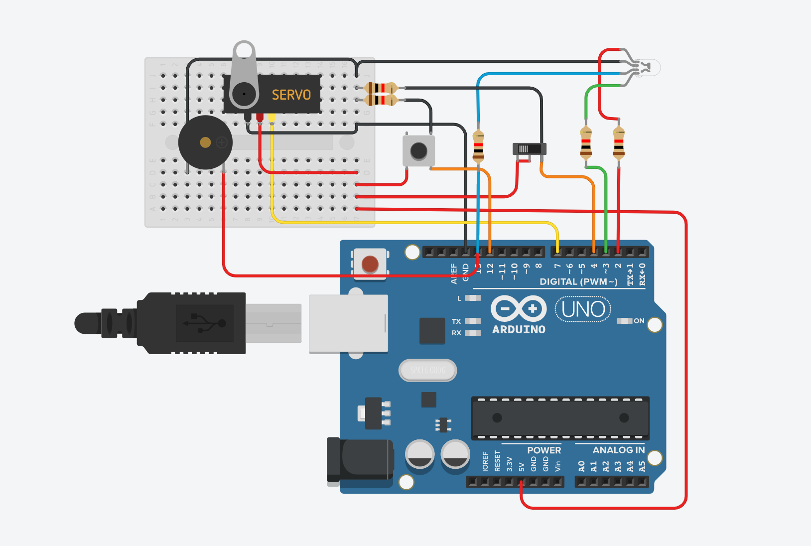

# google_solutions_challenge

## Arduino section

The PASSCODE here is 6512df4(for testing). It uses servo motor to drive the lock and the push button on the left is the door opening button, the one on the right was a Reed Switch (door is closed == on).
 
Red Led is status indicator and blue is Alarm, green is success(door opened). 
 
 
