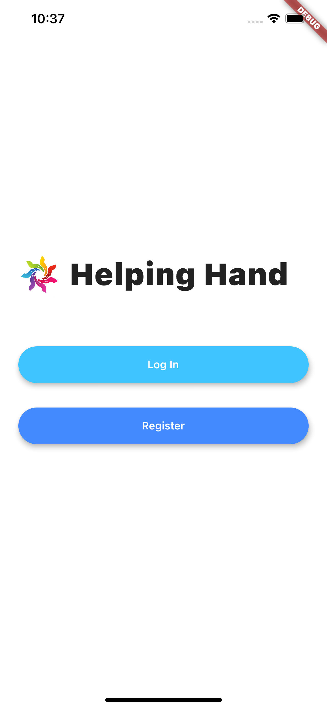
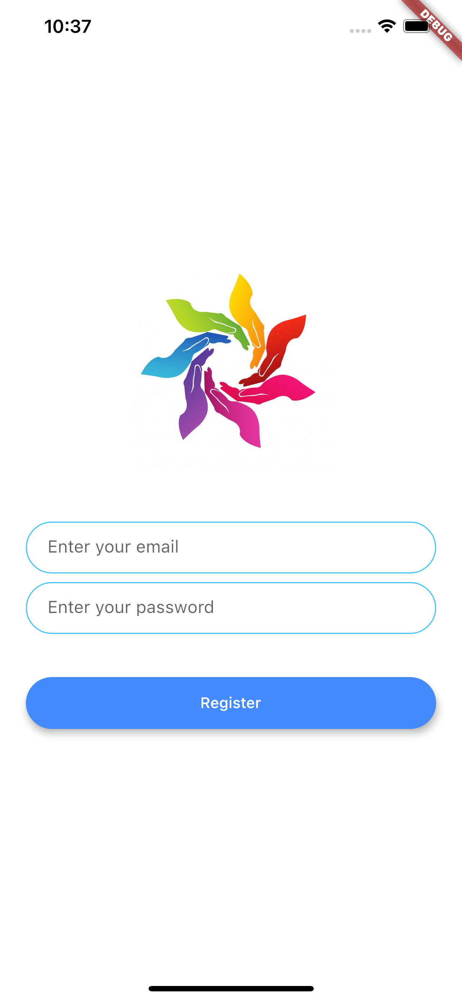

# google_solutions_challenge

<h1> Flutter progress <h1>
<h3> Completed 

welcome screen  

 

login screen 

 

register screen  

 

<h3> TODO <h3>
  Figma designed screens -> body needs to be added for home and dashboard  
  modify profile_screen  
  Firebase setup - incomplete  
  
<h3> Note <h3>
  modify screens located in lib folder as required  
  logo and name - temporary
 
